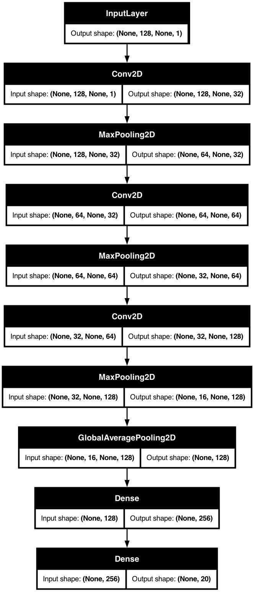
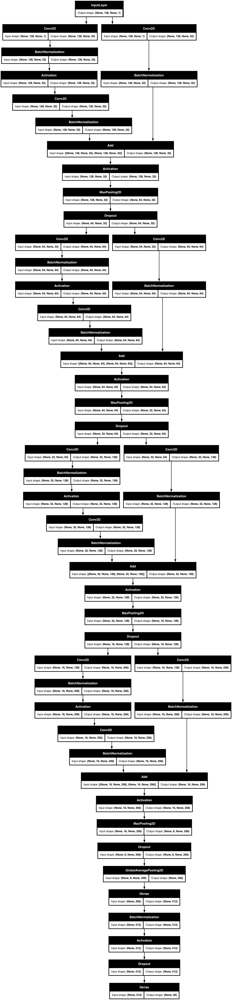
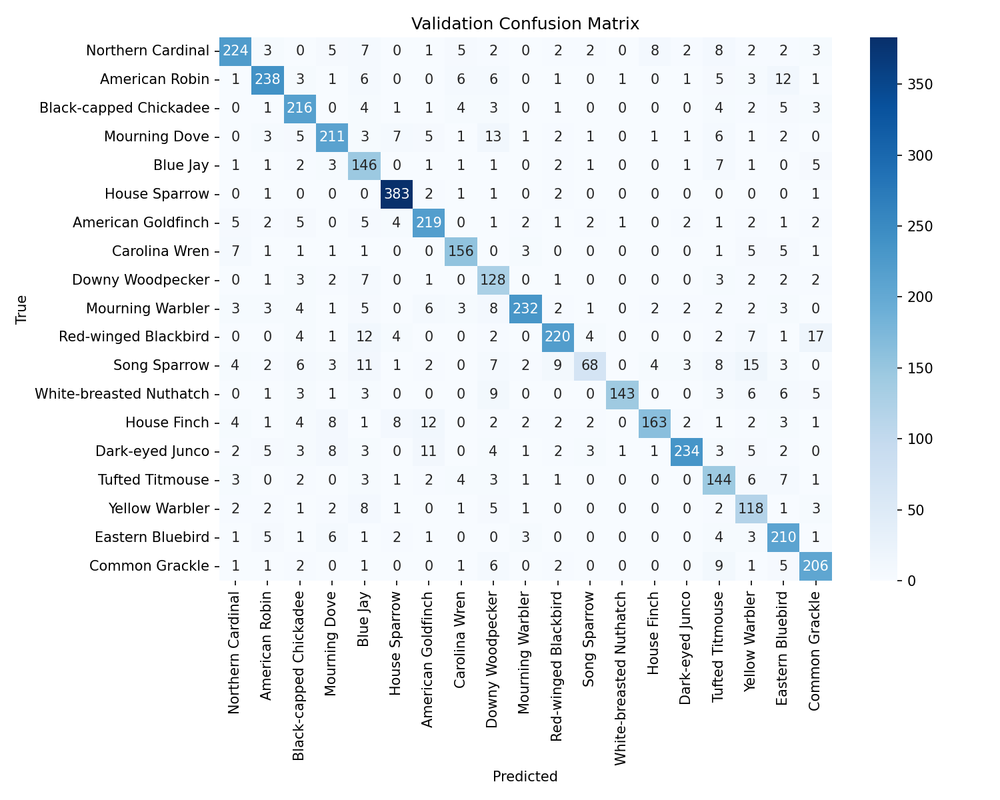

# Bird Detector

[](https://www.python.org/)
[](LICENSE)
[]()

---

## Overview

**Bird Detector** is an end-to-end pipeline for collecting, preprocessing, modeling, and evaluating bird-call audio data. We leverage Xeno-Canto recordings, segment them into fixed-length clips, extract MFCC features, and train three distinct classifiers:

* **CNN** baseline
* **4-block ResNet** with SpecAugment & cosine learning-rate decay
* **Random Forest** on handcrafted MFCC statistics

Use this repository to demonstrate a complete audio machine‑learning workflow, from data processing and feature extraction to model training and evaluation.

---

## Highlights

* **Automated data ingestion** from Xeno-Canto → AWS S3
* **Audio chunking** via FFmpeg and SoundFile
* **Parallel MFCC extraction** with Librosa + ThreadPool
* **Config-driven** hyperparameters (`src/config.yaml`)
* **Model training & checkpointing** with TensorFlow & Keras
* **Comprehensive evaluation**: accuracy, confusion matrices, classification reports
* **Reusable scripts** for each stage, clear directory structure

---

## Project Structure

```
.
├── README.md
├── project-overview.rmd      # High-level design + notes
├── requirements.txt
├── scripts/                  # Data download & preprocessing
│   ├── download_xc.py
│   ├── segment_calls.py
│   └── extract_features.py
├── src/                      # Core configs & model code
│   ├── config.yaml
│   ├── model_cnn.py
│   ├── model_resnet.py
│   └── model_rf.py
├── notebooks/                # Exploratory analysis
│   └── 01_data_inspection.ipynb
├── data/                     # (not checked in) raw/interim/processed
├── outputs/
│   ├── figures/
│   └── metrics/
└── models/                   # Saved `.keras` & `.pkl` files
```

---

## Installation

1. **Clone & activate**

   ```bash
   git clone https://github.com/Aysu-Maharramli/bird-detector.git
   cd bird-detector
   python3 -m venv .venv && source .venv/bin/activate
   pip install -r requirements.txt
   ```

---

## Data Collection & Preprocessing

1. **Download raw MP3 metadata & upload to S3**

   ```bash
   python scripts/download_xc.py
   ```

2. **Segment each MP3 into 5 s WAV clips**

   ```bash
   python scripts/segment_calls.py
   ```

3. **Extract MFCC features + build metadata CSV**

   ```bash
   python scripts/extract_features.py
   ```

---

## Model Training

All training scripts pull from `src/config.yaml` for parameters, just change tags or tweak hyperparams there.

### 1. CNN Baseline

```bash
python src/model_cnn.py --tag baseline
```

### 2. ResNet + SpecAugment

```bash
python src/model_resnet.py --tag specaug_cosinedecay
```

See [ResNet-4 Architecture](#resnet-4-architecture) for details.

### 3. Random Forest on MFCCs

```bash
python src/model_rf.py
```

After each run you’ll find:

* **Best checkpoints** in `models/`
* **Metrics & history** in `outputs/metrics/`
* **Confusion matrix `.csv`** + **classification report** `.txt`

---

## CNN Architecture

<p align="center">
  
</p>

A straightforward 3-layer CNN with progressive pooling and a dense head:

* **3 Conv→MaxPool blocks**: filters 32→64→128, each followed by ReLU activation and 2×2 pooling.
* **GlobalAveragePooling2D** to reduce spatial dimensions.
* **Dense head**: 256-unit hidden layer → softmax over 20 classes.

---

## ResNet-4 Architecture

<p align="center">
  
</p>

A compact ResNet-4 that combines convolution, skip connections, and regularization:

* **4 Residual Blocks**: each with two Conv→BatchNorm→ReLU layers plus identity shortcuts (filters grow 32→256).
* **Regularization & Scheduling**: SpecAugment masks on log-Mel inputs, dropout after pooling, and a cosine-decay learning-rate schedule.
* **Global Pool & Dense Head**: GlobalAveragePooling → 512-unit bottleneck (BatchNorm→ReLU→Dropout) → softmax over 20 classes.

---

## Results

| Model    | Val Accuracy |
| -------- | -----------: |
| CNN      |        77.2% |
| ResNet-4 |        85.5% |

<p align="center">
  
</p>

See `outputs/` for detailed results.

---

## Future Work

* **Hyperparameter tuning** 
* **Ensemble** of CNN + RF for boosted performance
* **Deploy** as a REST API or mobile demo app
* **Expand species** beyond the initial 20 

---

## Contributing

Feel free to open issues or PRs. For major changes, please fork first and submit a detailed PR with expected impact on accuracy or performance.

---

## License

Distributed under the **MIT License**. See [LICENSE](LICENSE) for details.

---

## Contact

Aysu Maharramli • [github: @Aysu-Maharramli](https://github.com/aysu-maharramli) • [aysumaharramli@gmail.com](mailto:aysumaharramli@gmail.com)

Happy bird-detecting!
